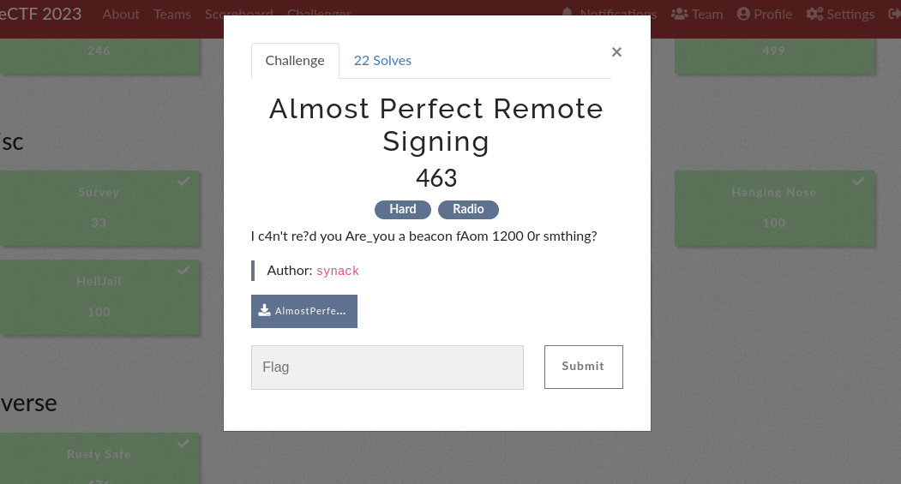
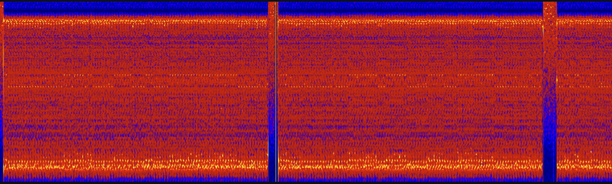
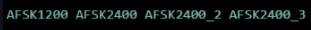
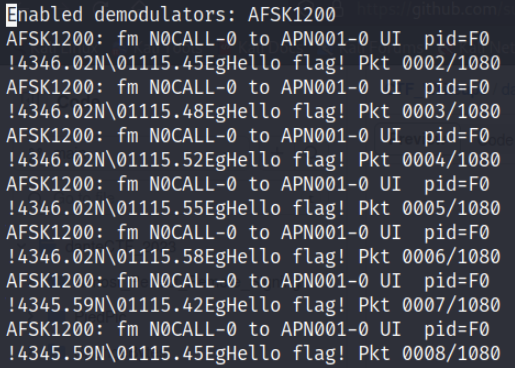
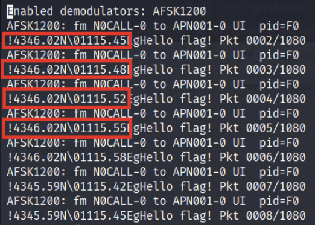
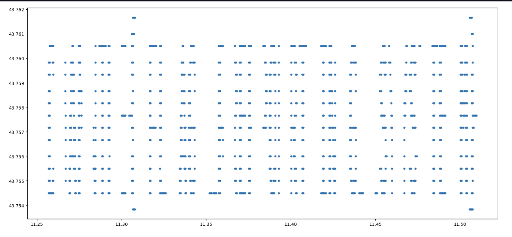
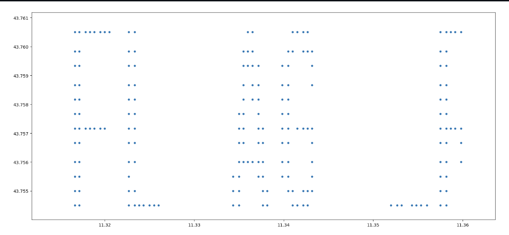

> **Difficulty:** Hard

> **Flag:** `DANTE{FLAG_REPORTING_SYSTEM}`

In this challenge, we are given a `.wav` file with the flag hidden somewhere inside it. Listening to the file yields nothing but ~8 seconds of what sounds like static noise, so we know the flag is encoded inside the sound data somehow. Running the file through steg tools like **Binwalk** and **WavSteg** doesn't reveal much, and LSB analysis doesn't show any signs of the image being encoded in the bits of the file. At this point, I opened the file in `Sonic Visualiser` to see what secrets may be encoded in the spectrogram or frequency information of the sound data. Examining the spectrogram, I saw something interesting:



There is a faint binary signal present in the spectrogram! This discovery led me to think that the flag was encoded in the sound data in binary manner somehow (using 0's and 1's). Being a novice in the area of digital signal processing, I had to do a significant amount of research to determine how this is achieved - via [AFSK](https://en.wikipedia.org/wiki/Frequency-shift_keying) (Audio Frequency Shift Keying). In this protocol, binary data is modulated onto a continuous analog signal for long-distance transmission (e.g., radio). To decode this manually would be a real hassle, so I looked up tools to automate the process. After trying and failing with tools like **GnuRadio**, I stumbled upon [multimon-ng](https://www.kali.org/tools/multimon-ng/). This tool will demodulate the signal and output the encoded data automatically, as long as it knows the exact protocol being used. There are several AFSK protocols to choose from:



And I ended up choosing AFSK1200 to start with (which turned out to be the right choice!).
This tool requires the `.wav` file to be in `.raw` format, which can be achieved using sox:

```
sox -t wav aprs_out.wav -esigned-integer -b16 -r 22050 -t raw aprs_out.raw
```

This command essentially takes the wave file and converts it to `.raw` format. Notice the sampling rate of 22050Hz being used here, which is the standard for these types of radio transmissions. Once this is done, we can use **multimon-ng** to decode the signal:

```
multimon-ng -t raw -a AFSK1200 aprs_out.raw > flag
```

After doing those steps the decoded data looks something like this.



We are definitely on the right track - we can see "Hello flag!" in every packet. If we scrutinize the data closely, we can see that there are slightly different coordinates used in each packet transmission:



Is the flag encoded in these coordinates somehow? Plotting these coordinates on a Cartesian coordinate system yields:



It's not pretty, but zooming in around small groups of characters can help us read the flag characters:


