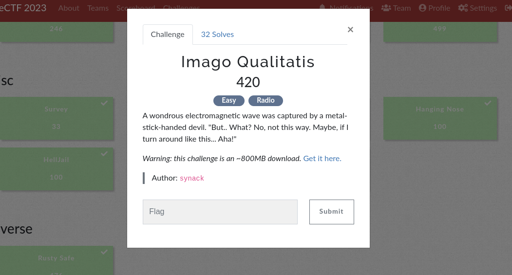
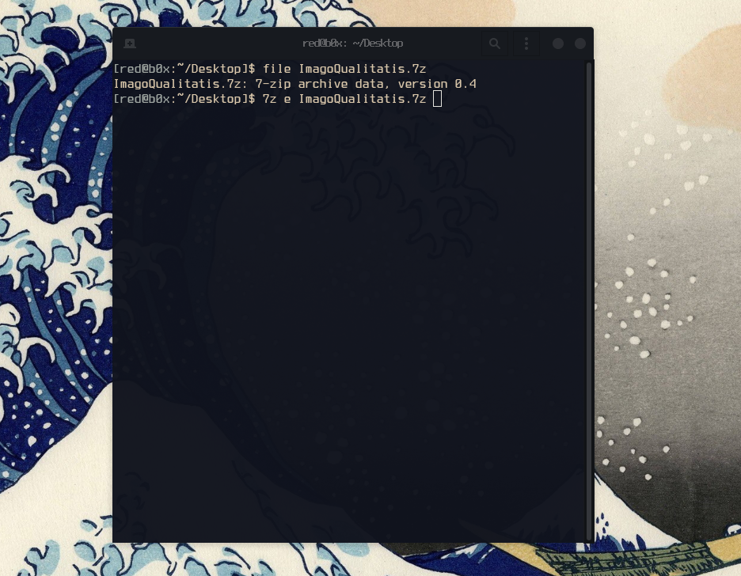
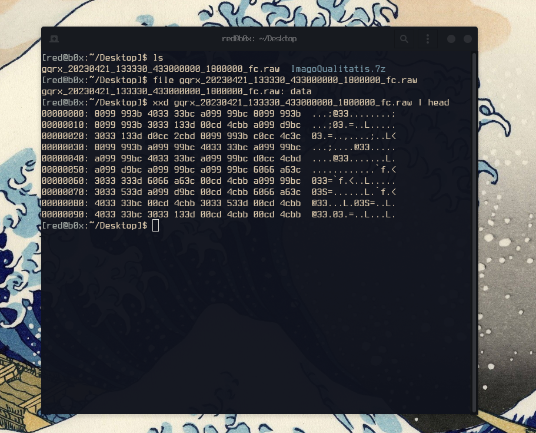
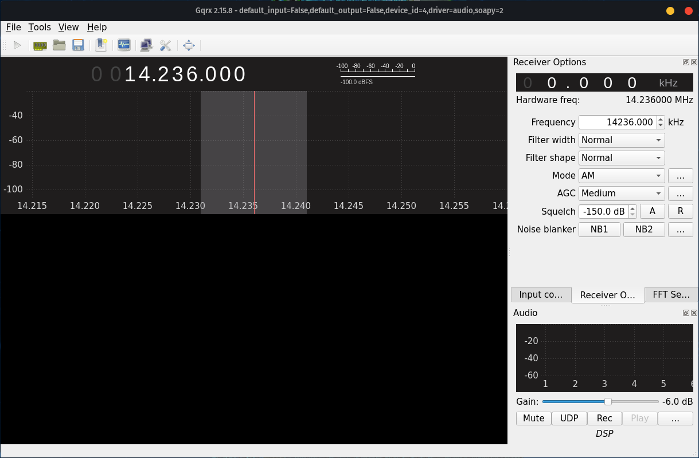
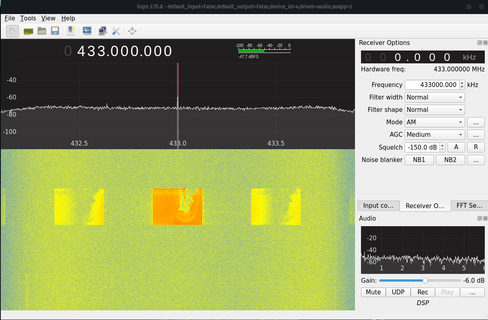
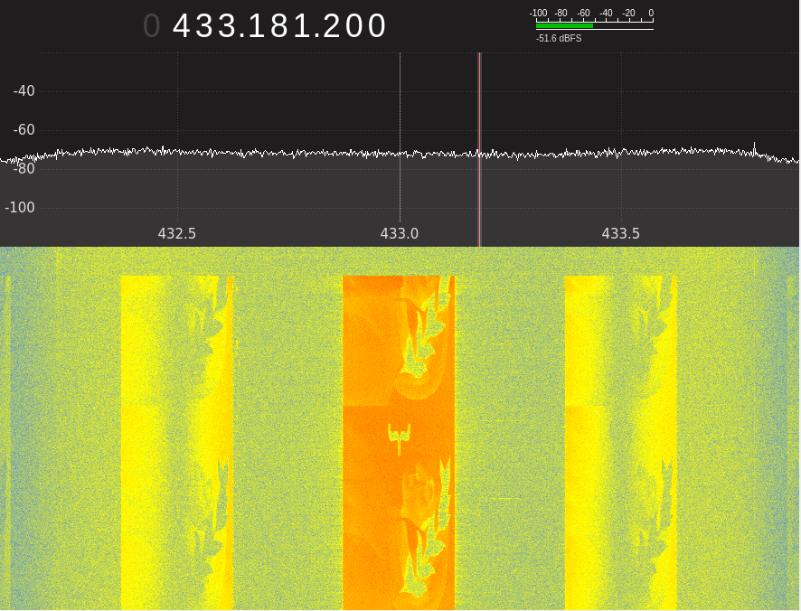

> **Difficulty:** Easy

> **Flag:** `DANTE{n3w_w4v35_0ld_5ch00l}`

First as always, lets download the file and see what we can do. This can take sometime since its not a small download (834 MB).

As we can see its a 7-Zip archive, lets extract what's inside this zip by running this command
**`7z e ImagoQualitatis.7z`**.

Great, we extracted the file successfully! I checked what type of file we are working with but no useful results came up, as well as I noticed that the size of it is very large being 4.6 GB. On top of that I also checked the file header, no luck there either even after some googling. We for sure know its something to do with **RF** so i researched a bit on software used to open such files, and to my luck i found a software called `GQRX`, which also is mentioned in the file name!

**Let's install it and give it a shot**

Interesting okay, time to try to open the file with that software and see if we get any luck, that can be done with going to `Tools --> I/Q Recoder --> Specifying the absolute path to our file`.

This was something we were for sure looking for! If there was one thing I learned from playing `CTFs` is always to be very patient while doing these type of challenges, and to no surprise after a few minutes I spotted a curly closing brace **}** which hints that other parts of the flag are to come.

By waiting for about 3-4 minutes, I ended up putting the pieces of the flag together character by character. In the end we got the *flag* and the first blood 🩸!
