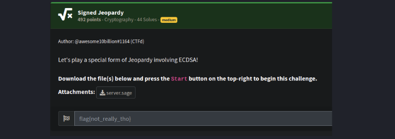
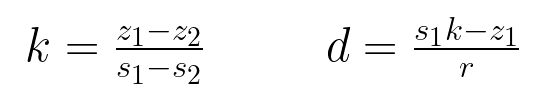
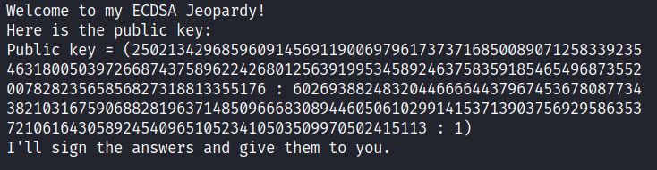
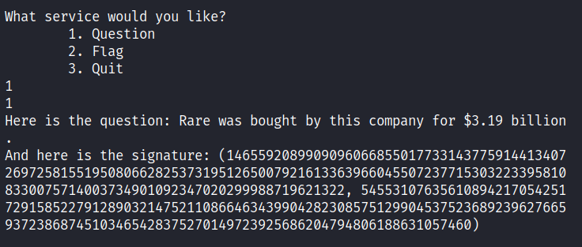
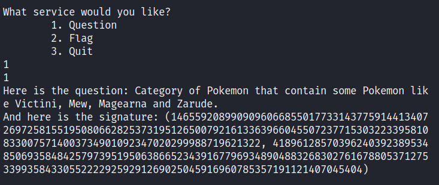
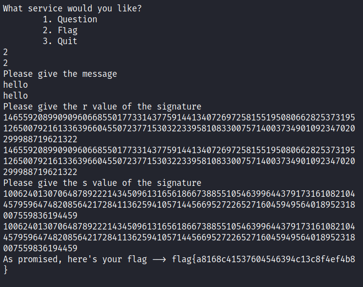

# Signed Jeopardy



> **Difficulty:** **Medium**  
> **Category:** **Cryptography**  
> **Flag:** **`flag{a8168c41537604546394c13c8f4ef4b8}`**

This writeup covers the challenge Signed Jeopardy from NahamConCTF 2023, which was probably the hardest crypto challenge in the competition, with only 44 solves.

In this challenge, we are given a file `server.sage` which implements the Elliptic Curve Digital Signature Algorithm (ECDSA) on the P521 curve. After generating the public key, the program opens a file called `questions.txt` and randomly selects questions about video game history and lore. It signs the answer to those questions and prints the question and signed answer to the console. The user can choose to receive questions and signed answers, and can also choose to sign a custom message. If the signature of the user’s message equals the signature calculated by the program, it gives the flag.

**server.sage:**

```python
from random import randint
from hashlib import sha512

with open("flag.txt",'r') as f:
    flag = f.read()

questions = []
answers = []
with open('questions.txt','r') as f:
    for x in f.readlines():
        a = x.split('\t')
        questions.append(a[0])
        answers.append(a[1][:-1])

# P521 standard curve parameters
p = 6864797660130609714981900799081393217269435300143305409394463459185543183397656052122559640661454554977296311391480858037121987999716643812574028291115057151
a = 6864797660130609714981900799081393217269435300143305409394463459185543183397656052122559640661454554977296311391480858037121987999716643812574028291115057148
b = 1093849038073734274511112390766805569936207598951683748994586394495953116150735016013708737573759623248592132296706313309438452531591012912142327488478985984
Gx = 2661740802050217063228768716723360960729859168756973147706671368418802944996427808491545080627771902352094241225065558662157113545570916814161637315895999846
Gy = 3757180025770020463545507224491183603594455134769762486694567779615544477440556316691234405012945539562144444537289428522585666729196580810124344277578376784
E = EllipticCurve(GF(p), [a, b])
G = E(Gx, Gy)
n = 6864797660130609714981900799081393217269435300143305409394463459185543183397655394245057746333217197532963996371363321113864768612440380340372808892707005449
k = randint(1,n-1)
d = randint(1,n-1)
Pub = d*G

def menu():
    print("\nWhat service would you like?")
    print("\t1. Question")
    print("\t2. Flag")
    print("\t3. Quit")

def sign():
    index = randint(0,len(questions)-1)
    question = questions[index]
    answer = "What is "+answers[index].upper()+"?"
    m_hash = int(sha512(answer.encode()).hexdigest(), 16)
    P = k*G
    r = int(P[0]) % n
    s = ((m_hash + (r*d))/k)%n
    print(f"Here is the question: {question}\nAnd here is the signature: ({r}, {s})")

def get_flag():
    print("Please give the message")
    message = input("")
    for a in answers:
        if a.casefold() in message.casefold():
            print("I can't have you using the answer of one of the questions as the message!")
            quit()
    print("Please give the r value of the signature")
    r_given = int(input(""))
    print("Please give the s value of the signature")
    s_given = int(input(""))
    m_hash = int(sha512(message.encode()).hexdigest(), 16)
    P = k*G
    r = int(P[0]) % n
    s = ((m_hash + (r*d))/k)%n
    if r == r_given and s == s_given:
        print(f"As promised, here's your flag --> {flag}")
        quit()
    else:
        print("Not the right signature. HAHAHA!")

def main():
    print(f"Welcome to my ECDSA Jeopardy!\nHere is the public key:\nPublic key = {Pub}\nI'll sign the answers and give them to you.")
    while True:
        menu()
        choice = int(input(""))
        if choice == 1:
            sign()
        elif choice == 2:
            get_flag()
        elif choice == 3:
            quit()
        else:
            print("Invalid choice. Please try again.")

if __name__ == "__main__":
    main()
```

After careful inspection of the code in `server.sage`, one can observe that the same nonce value `k` is reused to sign every answer. This is a critical implementation flaw in the ECDSA and the vulnerability which we will exploit in this challenge to retrieve the flag.

In the ECDSA, a random nonce value `k` is generated for each signature creation. The nonce value is used in conjunction with the private key to compute a point on the elliptic curve, which is in turn transformed into a valid signature. Since the purpose of the nonce is to provide randomness (uniqueness) to the signature generation process, it is of vital importance that `k` remains secret and is never reused. If it is reused, the attacker can directly compute `k` and the private key `d` and then forge signatures for arbitrary messages. As explained [here](https://en.wikipedia.org/wiki/Elliptic_Curve_Digital_Signature_Algorithm), if we have two messages `m1` and `m2` and their signatures `(r,s1)` and `(r,s2)`, we can compute the message hashes `z1` and `z2` and compute `k` and `d` by:



Thus, if we can select two questions from the server to answer - making sure to record the answer signatures - we can recompute `k` and `d` using the equations above. Then, we can choose an example message (such as “hello”) and compute its signature using the recovered values. Since we generate the signature using the same `k` and `d` used by the server, our signature should match the one computed by the server and we should be able to retrieve the flag!

First, let’s choose two simple questions to answer:  
  
  


The answers to these questions are Microsoft and Mythical, respectively. Note that these are our messages `m1` and `m2`, and we can compute their hashes to find `z1` and `z2`:

```python
from sage.all import * # For elliptic curves
from hashlib import sha512 # For hasing the message (we actually sign the HASH of the message, not the message itself)
from ecdsa.numbertheory import inverse_mod # inverse_mod == division (when moduli are involved)

# P521 standard curve parameters (from 'server.sage')
p = 6864797660130609714981900799081393217269435300143305409394463459185543183397656052122559640661454554977296311391480858037121987999716643812574028291115057151
a = 6864797660130609714981900799081393217269435300143305409394463459185543183397656052122559640661454554977296311391480858037121987999716643812574028291115057148
b = 1093849038073734274511112390766805569936207598951683748994586394495953116150735016013708737573759623248592132296706313309438452531591012912142327488478985984
Gx = 2661740802050217063228768716723360960729859168756973147706671368418802944996427808491545080627771902352094241225065558662157113545570916814161637315895999846
Gy = 3757180025770020463545507224491183603594455134769762486694567779615544477440556316691234405012945539562144444537289428522585666729196580810124344277578376784
E = EllipticCurve(GF(p), [a, b])
G = E(Gx, Gy) 
n = 6864797660130609714981900799081393217269435300143305409394463459185543183397655394245057746333217197532963996371363321113864768612440380340372808892707005449

# Note: n == the order of G (G == elliptic curve base point) which represents the total
# number of different possible points over the curve 

# Question 1: Rare was bought by this company for $3.19 billion.
m1 = "What is " + "Microsoft".upper() + "?"

# Question 2: Category of Pokemon that contain some Pokemon like Victini, Mew, Magearna and Zarude.
m2 = "What is " + "Mythical".upper() + "?"

# Compute the SHA512 hashes of the answers
z1 = int(sha512(m1.encode()).hexdigest(), 16)
z2 = int(sha512(m2.encode()).hexdigest(), 16)
```

Now that we have the hashes, we can use the signatures obtained from the server, `(r,s1)` and `(r,s2)`, to recover `k` and `d`:

```python
# Signature (r1, s1) of the first answer
r1 = 1465592089909096066855017733143775914413407269725815519508066282537319512650079216133639660455072377153032233958108330075714003734901092347020299988719621322
s1 = 545531076356108942170542517291585227912890321475211086646343990428230857512990453752368923962766593723868745103465428375270149723925686204794806188631057460

# Signature (r2, s2) of the second answer
r2 = 1465592089909096066855017733143775914413407269725815519508066282537319512650079216133639660455072377153032233958108330075714003734901092347020299988719621322
s2 = 4189612857039624039238953485069358484257973951950638665234391677969348904883268302761678805371275339935843305522229259291269025045916960785357191121407045404

# r must be equal for this to work (this is assumed, but we check just in case)
assert(r1 == r2)

# In the Elliptic Curve Digital Signature Algorithm, if the same k is used to sign
# different signatures (which is the case here), the attacker can recover k using
# the signatures (see https://en.wikipedia.org/wiki/Elliptic_Curve_Digital_Signature_Algorithm):
m_diff = (z1 - z2) % n
r1_inv = inverse_mod(r1, n)
s_diff = (s1-s2) % n

# Recover k and d using the formulas from the Wikipedia page
# Note that division is actually multiplication by the modular inverse!!
k = (m_diff * inverse_mod(s_diff, n)) % n
d = (((((s1 * k) % n) - z1) % n) * r1_inv) % n
```

Finally, we can use `d` and `k` to forge a valid signature for our own message, “hello”:

```python
# Now, sign a dummy message with the calculated keys and print out the signature
m_dummy = "hello"
m_dummy_hash = int(sha512(m_dummy.encode()).hexdigest(), 16)
P = k*G
r = int(P[0]) % n
k_inv = inverse_mod(k, n)
s = (((m_dummy_hash + ((r*d)%n)) % n) * k_inv) % n

# Print the recovered values (k & d) and the forged signature (r, s) to the console
print(f'k = {k}')
print(f'd = {d}')
print(f'r = {r}')
print(f's = {s}\n')
```

Output:

```text
k = 3716974158814584297095537945004349475177037436869930102241594403151123939279227740076878779097835920205545515879536767635099702998888815919895730302683232744
d = 2127236813394369802820290684263172937266777532372353713359324496964461876839310236381964658762852218580616002669515460043669806824304374603332980809612018763
r = 1465592089909096066855017733143775914413407269725815519508066282537319512650079216133639660455072377153032233958108330075714003734901092347020299988719621322
s = 1006240130706487892221434509613165618667388551054639964437917316108210445795964748208564217284113625941057144566952722652716045949564018952318007559836194459
```

Here comes the moment of truth! Let’s submit our message `hello` and forged signature `(r,s)` to the server and see if it’s correct:  


We got the flag! Moral of the story - *never* reuse your nonces!

Until next time…
