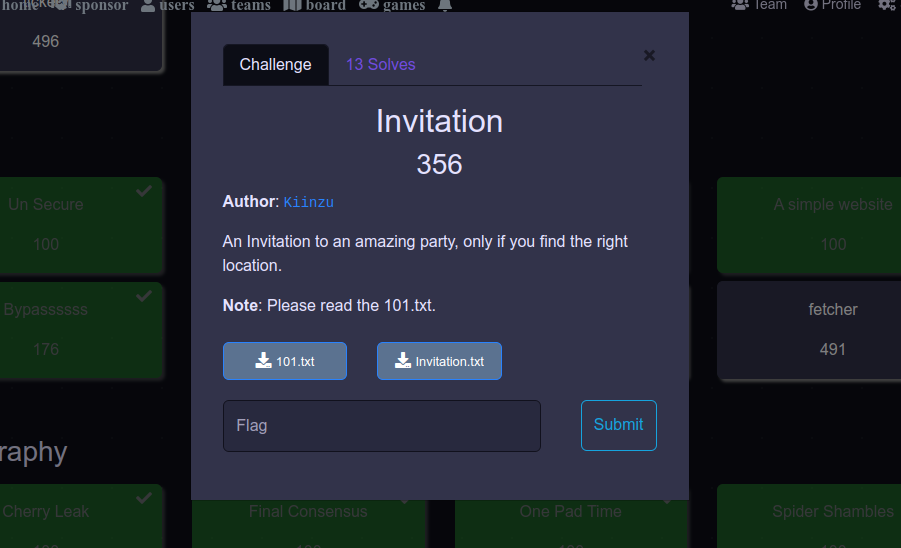
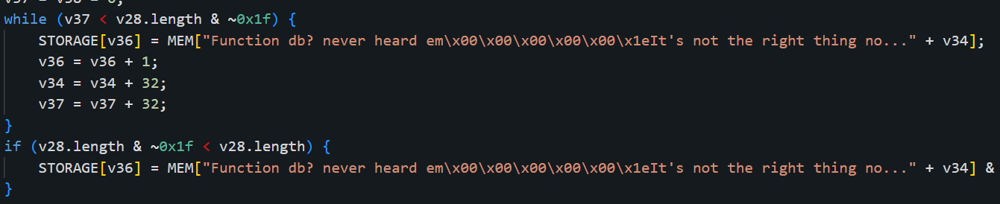
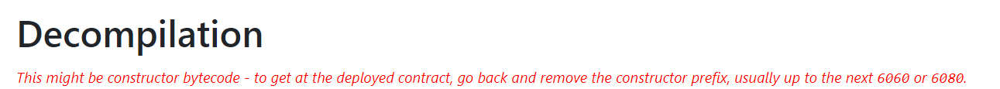
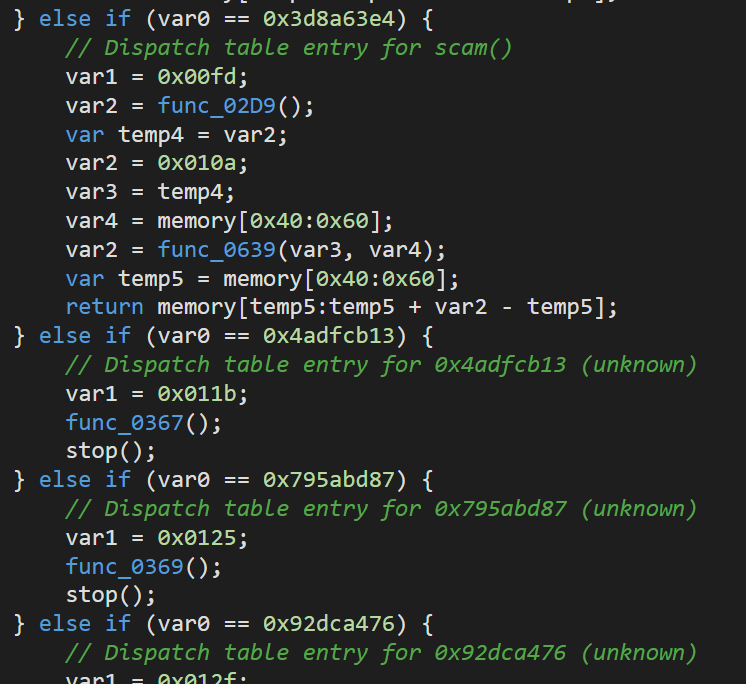
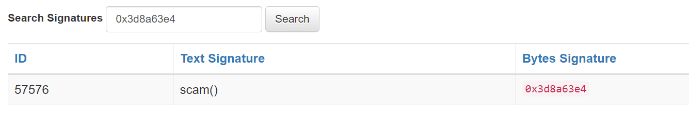
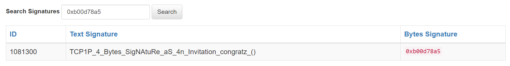
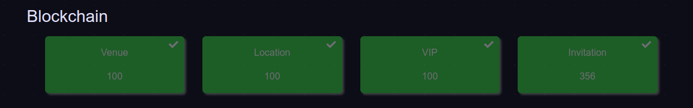

# Invitation



**Difficulty:** **Hard**  
**Category:** **Blockchain**  
**Flag:** **`TCP1P{4_Bytes_SigNAtuRe_aS_4n_Invitation_congratz}`**

We are given some bytecode in `101.txt`, and the challenge details in `101.txt` are as follows:

```text
Description:
    You are provided a bytecode there, yeah?
    Find out a way to get a certain function name from it,
    the correct function name begin with "TCP1P" string.

Flag Format
    if you manage to find the correct function name
    do the exact same thing as the example below

    Found Function name: TCP1P_th1s_1s_4_fl4g_()
        -> remove the "()"
        -> replace the first "_" with "{"
        -> replace the last "_" with "}"

    Final and Right flag format: TCP1P{th1s_1s_4_fl4g}
```

### Decompiling the Bytecode

First, let us decompile the bytecode. We head over to the [Dedaub decompiler](https://library.dedaub.com/decompile) to decompile our bytecode. What we get is a mess, but we do see some strings in the decompiled code that hint towards using `Function DB`.



Since the decompiled code wasn’t that helpful to us, let’s try another decompiler and hope it gives a better result. After pasting our bytecode into [Etherscan’s decompiler](https://etherscan.io/bytecode-decompiler), we indeed get some decompiled code, but wait a second, what’s this message?



Alright, whatever you say, Etherscan. We remove the construct prefix accordingly, and here’s a part of the decompiled result:



Huh, that’s interesting. The code is comparing `var0` to a bunch of 4-byte values, and they somehow correspond to functions (for example, `0x3d8a63e4` apparently corresponds to `scam()`). Here, we take a wild guess that these 4-byte values are the function signatures of all the functions available in the contract.

Indeed, we can verify our guess by calculating the signature of `scam()` ourselves!

```python
from Crypto.Hash import keccak
k = keccak.new(digest_bits = 256)
k.update(b'scam()')
print(k.hexdigest()[:8]) # '3d8a63e4', which matches 0x3d8a63e4 !
```

### Function DB?

Now that we have a bunch of function signatures, we can just brute-force all possible functions until we get the flag, right?  
No! Brute-forcing is obviously infeasible, so we turn to the next best option - `Function DB`.

`Function DB` a.k.a [Ethereum Signature Database](https://www.4byte.directory/) is a database that contains over a million function signatures and their corresponding human-readable representation.  
For example, searching for `0x3d8a63e4` gives you `scam()`.



The next logical step would be to try all the function signatures and hope we find something in `Function DB`. And indeed we do!



We found the flag!



Was a very fun category, me and my team enjoyed this ctf a lot! Till next time.
